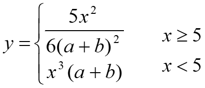
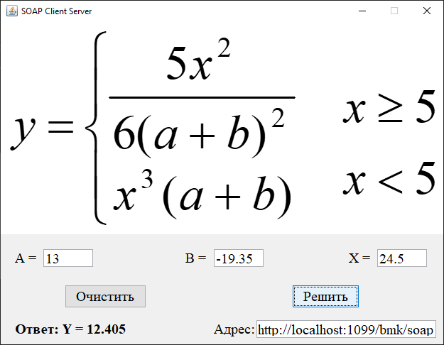
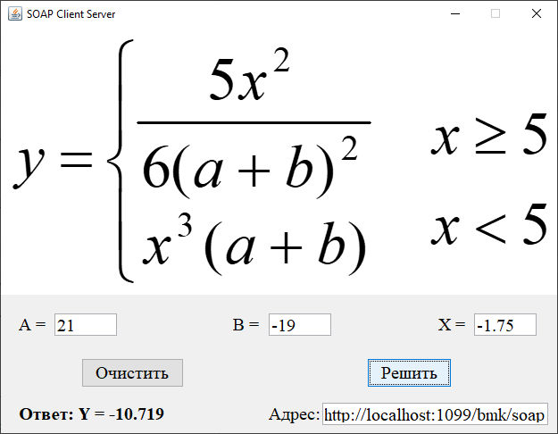
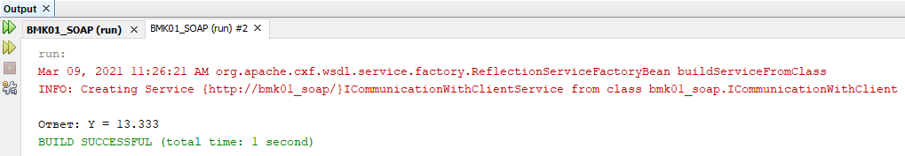
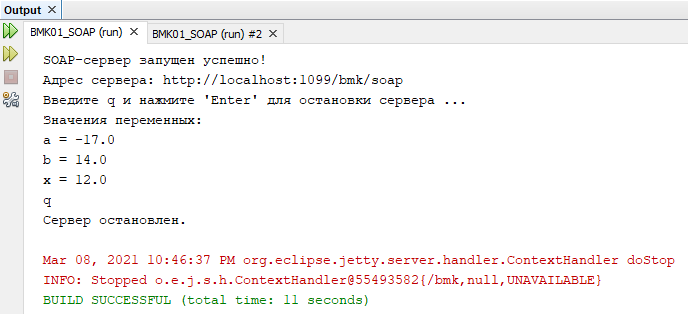

# BMK01_SOAP_Client_Server
## Разработка многоуровневых приложений
## Технология SOAP
Визуальная клиент-серверная программа на основе технологии SOAP на Java для распределенного расчета математического значения по заданному алгоритму.
### Лабораторная работа №5  
### Вариант - 1  

## Расчёт значения

## Вывод в консоли

